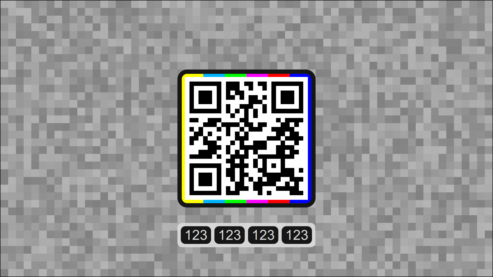

---

[tevolution](https://omega.gg/tevolution) is a [Remote Video Screen](https://omega.gg/about/RemoteVideoScreen) built for [Motion Freedom](https://omega.gg/about/MotionFreedom). 
Designed to take streaming requests from a [Semantic Player](https://omega.gg/about/SemanticPlayer). 
[omega](https://omega.gg/about) is building tevolution to empower people. 

## tevolution

tevolution streams videos remotely from a Semantic Player like [MotionMonkey](https://omega.gg/MotionMonkey). 
It supports [DuckDuckGo](https://en.wikipedia.org/wiki/DuckDuckGo),
            [vox](https://omega.gg/vox),
            [BitTorrent](https://en.wikipedia.org/wiki/BitTorrent),
            [TMDB](https://www.themoviedb.org),
            [Youtube](https://en.wikipedia.org/wiki/Youtube),
            [Dailymotion](https://en.wikipedia.org/wiki/Dailymotion),
            [Vimeo](https://en.wikipedia.org/wiki/Vimeo),
            [Twitch](https://en.wikipedia.org/wiki/Twitch_(service)),
            [IPTV(s)](https://github.com/iptv-org/iptv),
            [TikTok](https://en.wikipedia.org/wiki/TikTok),
            [Twitter](https://en.wikipedia.org/wiki/Twitter),
            [Facebook](https://en.wikipedia.org/wiki/Facebook),
            [Odysee](https://en.wikipedia.org/wiki/Odysee),
            [PeerTube](https://en.wikipedia.org/wiki/PeerTube),
            [Last.fm](https://en.wikipedia.org/wiki/Lastfm) and
            [SoundCloud](https://en.wikipedia.org/wiki/SoundCloud). 
All of this while serving the end user at all time and without ever showing an ad. 

## Technology

tevolution is built in C++ with [Sky kit](https://omega.gg/Sky/sources). 

## Platforms

- Windows XP and later.
- macOS 64 bit.
- Linux 32 bit and 64 bit.
- iOS 64 bit.
- Android 32 bit and 64 bit.

## License

Copyright (C) 2015 - 2024 tevolution authors | https://omega.gg/tevolution

### Authors

- Benjamin Arnaud aka [bunjee](https://bunjee.me) | <bunjee@omega.gg>

### Private License Usage

tevolution licensees holding valid private licenses may use this file in accordance with the private
license agreement provided with the Software or, alternatively, in accordance with the terms
contained in written agreement between you and tevolution authors. For further information
contact us at contact@omega.gg.
